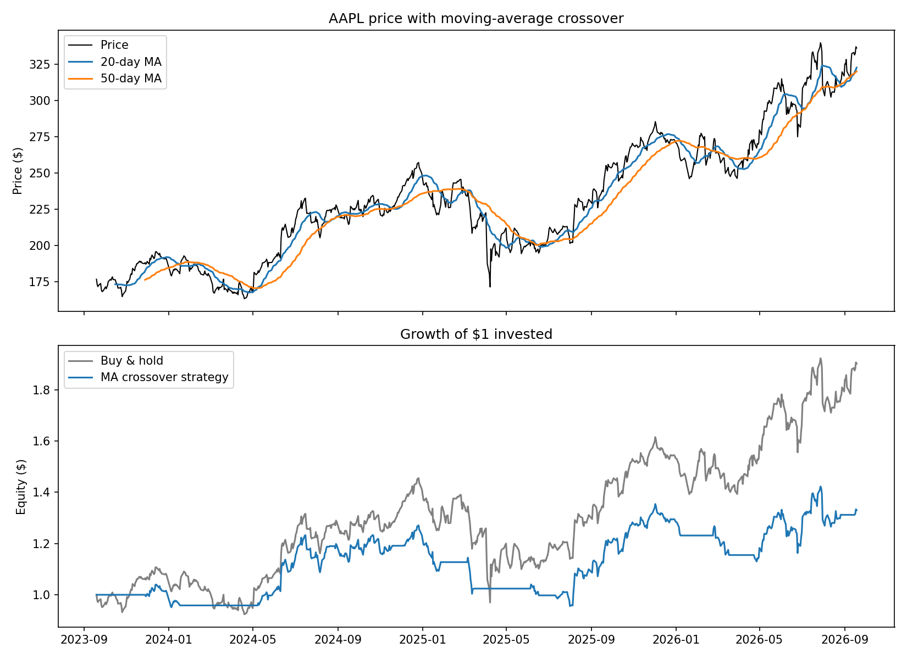

# Trading Bot

An automated algorithmic trading system built with Python, using a moving-average crossover strategy on paper-traded stocks via the Alpaca API.


*Output of `backtest.py AAPL` — price with the 20/50-day crossover on top, growth of $1 under the strategy vs. buy-and-hold below.*

## What it does

- Pulls historical price data and computes a 20-day / 50-day moving average crossover signal
- Automatically places or skips trades based on that signal, with duplicate-order protection (checks pending orders before placing new ones)
- Runs unattended every weekday via `cron`, scheduled around market open
- Logs every decision — trade or skip — to `trade_log.csv` for a full history

## Risk management

- **Circuit breaker**: refuses to place new trades if the account is down more than a set % on the day
- **Stop-loss**: automatically closes a position if it drops more than 5% from entry
- **Position sizing**: sizes each trade based on a fixed % of account equity at risk, capped at a maximum position size

## Tech stack

- Python
- [Alpaca API](https://alpaca.markets) (paper trading)
- pandas / numpy for backtesting and data handling
- matplotlib for the backtest chart
- macOS `cron` for scheduling
- scikit-learn (used in the overfitting experiment below)

## Backtesting

`backtest.py` compares the moving-average crossover strategy against simple buy-and-hold over the same historical period, net of a per-trade transaction cost, and reports CAGR, Sharpe ratio, and max drawdown for both:

```bash
python3 backtest.py AAPL --period 3y
```

Over the last 3 years on AAPL, buy-and-hold outperformed the crossover strategy once trading costs were included — that's reported here rather than hidden, since a backtest that only shows periods favoring the strategy isn't an honest one.

`experiments/overfitting_experiment.py` is the ML experiment mentioned above: a Random Forest classifier trained on price-derived features (rolling returns, moving-average distance, volatility) to predict next-day direction, with a **chronological** train/test split (a random shuffle would leak future data into training). It reports training accuracy, held-out test accuracy, and a naive baseline (always predicting the more common direction), side by side:

```bash
python3 experiments/overfitting_experiment.py AAPL --period 5y
```

Training accuracy is consistently far higher than test accuracy, which barely clears the naive baseline — a concrete, runnable demonstration of overfitting on financial time series, and the actual reason `trading_bot.py` sticks to the simpler, more transparent moving-average approach in production rather than this model.

## Setup

```bash
git clone <repo-url>
cd trading-bot
python3 -m venv venv
source venv/bin/activate
pip install -r requirements.txt
```

Create a `.env` file (not committed — see `.gitignore`) with your Alpaca API credentials:

```
ALPACA_API_KEY=your_key_here
ALPACA_SECRET_KEY=your_secret_here
```

Run it manually:

```bash
python3 trading_bot.py
```

Or schedule it via `cron` to run automatically on weekdays.

## Project structure

```
trading-bot/
├── trading_bot.py                        # Live paper-trading loop (run via cron)
├── backtest.py                           # MA crossover vs. buy-and-hold backtest
├── experiments/
│   └── overfitting_experiment.py         # RF classifier overfitting demonstration
└── requirements.txt
```

## Status

Currently running in **paper trading mode only** — no real money is involved. This is a learning project exploring algorithmic trading, risk management, and the practical pitfalls of applying ML to financial data.

## Disclaimer

This project is for educational purposes. Nothing here is financial advice, and past backtest performance is not indicative of future results.
